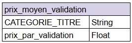
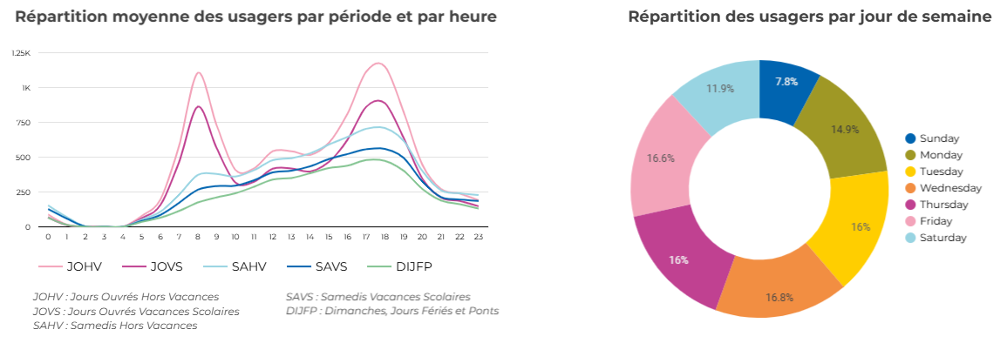

# Free tickets (let's dream)
## A study on the impact of free tickets in the parisian subway

I made this analysis along with 3 other teammates at Le Wagon. This is the final project we presented on our last day in front of all the bootcamp participants. We played the role of external consultants that make recommendations to Ile-de-France Mobilités (IDFM), i.e. the entity that manages public transportation in the region.  

➡️ Read the data transformation presentation [here](https://docs.google.com/presentation/d/1oL-Tq8IW-vz1SThDDeRLEMGLRJV-Heb2UD_2cxzZhlA/edit?usp=sharing) (in French)  
➡️ Access the final dashboard we presented [here](https://lookerstudio.google.com/u/1/reporting/2155cd6b-8a4a-4ff5-a74e-8d4efbb9c34c/page/p_3xqoufdccd) (in French)

### ⚠️ Disclaimer
This analysis is made with public data only: we did know that the analysis is not completely suited for the "real" world. We did not have any information about IDFM's capacity of evolution in terms or infrastructure, nor about their detailed budget. However, I think our presentation is still interesting both for the data manipulation we made and the content that came out of it. 

### 📄 Table of contents
- [Summary & objective](#-summary--objective)
- [Data source and perimeter of the analysis](#-data-source-and-perimeter-of-the-analysis)
- [Data cleaning with Python](#-data-cleaning-of-the-main-data-source-with-python-pandas-library)
- [Data tranformation with Python](#-data-transformation-with-python-pandas-library-create-a-first-table-containing-the-hourly-validations)
- [Data transformation with SQL](#-data-transformation-with-sql-bigquery-create-a-second-table-with-the-calculation-of-the-gap-of-revenue)
- [Data Vizualisation and analysis with Looker Studio](#-data-vizualisation-and-analysis-with-looker-studio)  

### 📝 Summary & objective
Our objective was to assess the consequences of partially / completely free tickets in the parisian subway. 
We chose 3 axis to develop our analysis: peak periods, budget and environment:
- 👫 <ins>**Peak periods**:</ins> how can free tickets impact rush hours and frequentation ? Can IDFM absorb the extra passengers ? **Main KPI : number of validations**
- 💰 <ins>**Budget**:</ins> How much will the shortfall cost if IDFM does not sell any more tickets ? What is the best strategy between partially or totally free tickets ? **Main KPI: estimation of the loss of income**
- 🌱 <ins>**Environment**:</ins> Can we estimate the impact of free tickets on CO2 emissions in the Paris area ? **Main KPI: tons of CO2 emissions**

### 📥 Data source and perimeter of the analysis
**Main data source** : [Plateforme Régionale d'Information pour la Mobilité](https://prim.iledefrance-mobilites.fr/fr) (PRIM) for frequentation data and types of tickets  
**Secondary data source** : [Portail OpenData d'AirParif](https://data-airparif-asso.opendata.arcgis.com/) for data about greenhouse gas emissions.

- The data comes out as csv files, one for 2022 data and one for 2023. Railroad network (subway, RER) and road network (bus, tram) are also separated into different files.  
- The analysis goes from June 2022 to June 2023 to get one complete year of data.  
- Due to the short time we had to analyze the data, we decide to narrow our perimeter to **the inner Paris railroad network**, excluding de facto subway stations outside of Paris and bus / tram data.
- 2 main types of tables: **validations** (number of validations by ticket categories, days ands stations) and **profil horaire** (percentage of validations by hour, type of day, and stations) - See ERD below
- secondary tables: geolocation, information about tickets, type of days (week-days, week-ends, bank holidays, school vacation) - See ERD below

  

🔗[Go back to the Table of contents](#-table-of-contents)  

### 🚿 Data cleaning of the main data source with Python (Pandas library)

<ins>Here are the cleaning actions we performed on the **validations** table, i.e. our main table</ins>
- **Concatenate the 2022 and the 2023 tables**
  ```Python
  df_concat = pd.concat([df_final,df2_final], axis=0).reset_index(drop=True)
  ```
- **Treat null values**  
  We chose to drop null values because it was only a very small part of the data, among several millions of lines in the table, so the impact would be minimal.
  ```Python
  df_clean = df_concat.dropna()
  ```
- **Filter on inner Paris data**  
  In order to apply this filter, we had to keep only lines where the variable CODE_STIF_TRNS equals 100
  ```Python
  mask_stif_trns = df_clean['CODE_STIF_TRNS']==100
  df_final = df_clean[mask_stif_trns]
  ``` 
- **Drop useless columns**  
  Removing columns containing internal codes or references that are not relevant for filtering or analysis
  ```Python
  df_final = df_final.drop(columns=df_final[['CODE_STIF_ARRET','lda','CODE_STIF_RES','CODE_STIF_TRNS']])
  ``` 
- **Format data types**  
  Changing the 'JOUR' column in date format, and the 'NB_VALID' in numeric format
  ```Python
  df_final['JOUR'] = pd.to_datetime(df_final['JOUR'],format=%d/%m/%Y)
  df_final['NB_VALID'] = df_final['NB_VALID'].astype(int)
  ```

<ins>As for the other tables:</ins> 
- We performed similar actions on the **profil horaire** table (concatenate, drop null values, filter and reformat)
- The other tables were way smaller, and will be useful to qualify the data (type of day, type of client). These tables were quite clean already. 

<ins>After cleaning the data, the **validations** and the **profil_horaire** table schemas are as follows:</in>  
    

**JOUR** = date (day)   
**LIBELLE_ARRET** = name of the subway station  
**CATEGORIE_TITRE** = type of subway card (full price, monthly subscription, student price...)   
**NB_VALID** = number of validations  
**CAT_JOUR** = category of day as defined by IDFM (weekday, week-end, bank holiday, school vacation)  
**TRNC_HORR_60** = hour of the day (60-minute periods)   
**pourc_validations** = percentage of validations counted in the specific hour of the day  

🔗[Go back to the Table of contents](#-table-of-contents)  


### 🪄 Data Transformation with Python (Pandas library): create a first table containing the hourly validations

- **Group by JOUR, LIBELLE_ARRET, CATEGORIE_TITRE, sum of NB_VALID** - *validations table*
  ```Python
  validations = validations.groupby(['JOUR','LIBELLE_ARRET','CATEGORIE_TITRE'], as_index=False).sum()
  ```
- **Add type of day using a join with the type_jour table** - *validations table*
  ```Python
  validations = validations.merge(type_jour, on='JOUR', how='left')
  ```
- **Create a join key between validations and profil horaire** - *validations AND profil horaire table*
  ```Python
  validations['station_jour'] = validations['LIBELLE_ARRET'] + validations['CAT_JOUR']
  profil['station_jour'] = profil['LIBELLE_ARRET'] + profil['CAT_JOUR']
  ```
- **Add TRNC_HORR_60 and pourc_validations to the validations table with a LEFT JOIN on profil horaire**
  ```Python
  validations = validations.merge(profil, on='station_jour', how='left')
  ```
- **Calculate the number of validations by hour of the day** - *validations table*
  ```Python
  validations['valid_horaire'] = validations['NB_VALID']*validations['pourc_validations']/100
  #format this new column as an integer because validations can only be an integer:
  validations['valid_horaire'] = validations['valid_horaire'].astype(int)
  ```
- **Rename the table**
  ```Python
  valid_horaire = validations
  ```
  We now have a new enriched table **valid_horaire** as follows, that we can export in BigQuery:  
    

- **Export in BigQuery**
  ```Python
  from pandas_gbq import to_gbq
  to_gbq(df, f'free_tickets.valid_horaire', project_id=training-431014, if_exists='append')
  ```

🔗[Go back to the Table of contents](#-table-of-contents)  


### 🪄 Data transformation with SQL (BigQuery): create a second table with the calculation of the gap of revenue  

Part of the transformation we did has been made with Python, the other one has been made in BigQuery with SQL, because we were working together at the same time, and each of us was experiencing different techniques. 

The objective here is to get information about the prices of the different tickets, in order to estimate the shortfall due to the end of ticket sales (i.e. the money IDFM is going to lose if nobody pays). 
The first thing we had to do was to determine the average price of a validation for each type of ticket. The idea was to take the data we had on one year, and calculate the daily average price of a validation by type. 
That is how we came out with this table **prix_moyen_validation**:  
  

We also worked with the cleaned **validations** table we exported in BQ from our Python notebook:  
  

- **Add the unit price of a validation to the validations table**
  ```SQL
  SELECT
  validations.*,
  prix_moyen_validation.prix_par_validation
  FROM validations LEFT JOIN prix_moyen_validation USING CATEGORIE_TITRE
  ```

- **Add the total shortfall ('GAP_REVENU') to the validations table**
  ```SQL
  SELECT
  *,
  NB_VALID * prix_par_validation AS GAP_REVENU
  FROM validations
  ``` 

- **Add geolocation data to the validations table**  
With a left join on the name of the subway stations ('LIBELLE_ARRET'), we also added the data coordinates of each station (coming from a       secondary table **emplacement_gares_ligne_metro**, see ERD), because it could possibely be useful for graphs in Looker Studio. 
  ```SQL
  SELECT
  validations.*,
  geo.Geo_Shape,
  geo.Geo_Point
  FROM validations LEFT JOIN emplacement_gares_ligne_metro AS geo USING LIBELLE_ARRET
  ```

So we ended with another enriched **validations** table containing the financial information we need:  
  


At the end of our data transformation, we had 2 enriched tables, **valid_horaire** and **validations**, that we exported in Looker Studio to structure our analysis. 

🔗[Go back to the Table of contents](#-table-of-contents)  


### 📊 Data Vizualisation and Analysis with Looker Studio

<ins>**FIRST AXIS : IMPACT OF FREE TICKETS ON FREQUENTATION**</ins> 👫 

The first thing to say about frequentation is that we have to take into account several parameters that have a big impact on the analysis: the number of validations depends on the location (center vs border of Paris), on the day of the week (more traffic during weekdays), and on the hour of the day (the peak hours being 8am and 6pm especially on weekdays), as we can see in these graphs below:

  



The idea is to anticipate what will be the total frequentation by year and average by day if it increases when tickets are free. We made 3 hypothesis: low, medium and high increase. This is what we have in the capture below.   
- **LOW**: Freqentation increases by 2% ➡️ It represents 19.5 millions more people in the subway in a year, i.e. 54K more people a day on average  
- **MEDIUM**: Frequentation increases by 5% ➡️ It represents 48.7 millions more people in the subway in a year, i.e. 136K more people a day on average  
- **HIGH**: Frequentation increases by 10% ➡️ It represents 97.4 millions more people in the subway in a year, i.e. 272K more people a day on average  

  

What is interesting is that we can filter these figures and graphs by type of day and / or by subway station. It can be useful for IDFM to anticipate which are the days, hours or stations that will be jammed and could require additionnal service. It is a way to know if they can offer free tickets given their capacity and budget.  
For example, these are the figures we get when we filter on week-ends + bank holidays only (school vacation week-ends included):  

  

🎯 We do not have access to capacity and infrastructure budget, so the recommendations we made could be more precise, but based on the insights we have, and because week-ends represent around 20% of the traffic, we can say that if IDFM wants to test free tickets, it could be interesting to focus this test on week-ends only. Some cities already offer this type of gratuity, like Nantes for example, although the city is way smaller than Paris.  

<ins>**SECOND AXIS : IMPACT OF FREE TICKETS ON BUDGET**</ins> 💰 

Public data published in 2022 by IDFM shows that their total budget for the year is **10 billions euros**, with **4,8 billions euros** for the subway entity (RATP: Régie Autonome des Transports Parisiens). This will be our basis for comparison with the budget loss we calculate. The dashboard image below gives us a global view, and a breakdown by type of day / type of ticket, of the budget loss estimation. 

  

- Totally free tickets would cause a loss of 123.08 millions euros according to our calculation, which represents 2.56% of the RATP budget. 
- As we can expect, the most impactful type of day is "JOVS", which means: week days exluding school holidays. It represents more than 50% of the budget loss alone (70 millions euros, 1.47% of the RATP budget). These are the days when people go to work using public transports, so this is quite logical. On the contrary, when filtering on week-ends and bank holidays, we have a 27 millions euros loss (0.56% of the RATP budget). 
- The type of ticket which impacts most the analysis is the Navigo pass (monthly rate), because this is the most widely used (86 millions euros, 1,79% of the RATP budget, almost 70% of the total calculated loss). The other types of tickets are meant for people who benefit from price reductions (students, unemployed, old or disabled people), or for daily Navigo rates.

🎯 We don't have access to the total costs of IDFM, so we know that the calculation we made does not include the total cost of free tickets (which would take into account the services cost for example), but based on the data we have, we can say:
1. That we confirm our recommendation to start with free tickets on week-ends.
2. That we recommend to start with cheaper tickets to minimize the budget impact before considering free Navigo passes.  

<ins>**THIRD AXIS : IMPACT OF FREE TICKETS ON CO2 EMISSIONS**</ins> 🌱  

The ecological impact of reducing public transport prices is an argument which is often used by administrations to encourage it. For example, when public transport in Montpellier (south of France) became totally free, it was mentionned in the city communication. 

 

This is why it seemed important to us to work on the subject. In theory, CO2 emissions should be reduced if people who use a car switch transport modes and start using public transports instead. The idea is to try to estimate that decrease of CO2 emissions with the frequentation hypothesis we made before: among all the incremental traffic we estimate, we make the hypothesis that some part is attributed to the car drivers. We made this part quite low, around 10%, after looking at figures online, to try not to overestimate the impact. Thanks to public data, we also know that people travelling by public transports emit 35 times less CO2 than people travelling by car. This allows us to calculate a yearly decrease of CO2 emissions for each frequentation hypothesis. 

  

So, if we consider the 3 hypothesis:
- **LOW**: Freqentation increases by 2% ➡️ 1.95 millions former car drivers in the subway in a year, i.e. a reduction of 254 tons of CO2 emissions.  
- **MEDIUM**: Frequentation increases by 5% ➡️ It represents 4.87 millions former car drivers in the subway in a year, i.e. a reduction of 634 tons of CO2 emissions.  
- **HIGH**: Frequentation increases by 10% ➡️ It represents 9.74 millions former car drivers in the subway in a year, i.e. a reduction of 1268 tons of CO2 emissions.

Note: our estimation may seem quite low, but doing the exercise is always interesting. The context may vary in the next years with more electric cars, maybe also more traffic regulation in the inner Paris area... So this is a difficult subject !

### 💡 Conclusion and final recommendation


